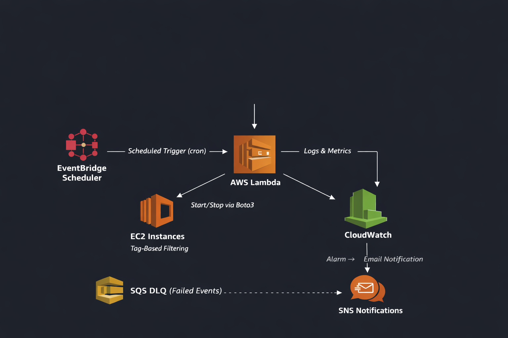

# AWS Lambda + EventBridge EC2 Scheduler

## Description
Event-driven automation to start and stop EC2 instances across multiple environments using AWS Lambda, EventBridge and Boto3.

## Features
- Scheduled automation
- Environment-aware instance targeting (Dev, UAT, Prod)
- Cost optimisation use case
- Serverless architecture

## Architecture



### Event Scheduling Layer
- Separate cron-based schedules are configured in EventBridge Scheduler per environment and action.
- Each schedule emits a structured JSON event payload containing both the required `action` and the target `environment` (e.g., `{ "action": "start", "environment": "dev" }`).
- This allows the Lambda function to dynamically determine execution behaviour and target the exact subset of instances needed.
- Enables fully automated, time-based infrastructure control without manual intervention or hardcoded schedules.

### Compute Layer (Serverless Orchestration)
- The schedule triggers an AWS Lambda function.
- AWS Lambda acts as the orchestration engine, executing logic without provisioning or managing servers.

### Execution & AWS Integration (Lambda Function)
- Uses Boto3 to interact programmatically with AWS resources.
- Dynamically filters EC2 instances using exact case-sensitive tags (e.g. `Environment=Dev`, `AutoSchedule=True`).
- Determines actions (start/stop) based on event context.

### Resource Management Layer
- EventBridge defines *when* actions occur and *which* environment is targeted, while Lambda + Boto3 define *what* actions are executed on EC2 resources.
- Ensures environment resources run only when needed, reducing unnecessary compute usage across non-production and staging environments.

### Observability, Monitoring & Alerting
- Logs and execution metrics are captured in Amazon CloudWatch.
- Enables debugging, auditing, and basic operational monitoring through logs and metrics.
- A Dead-Letter Queue (DLQ) using SQS is configured on EventBridge Scheduler to capture failed event triggers.
- Lambda function errors are captured using a CloudWatch Alarm, which triggers an SNS topic to send email notifications.

---

## Setup / Deployment

**1. Create an IAM role for Lambda with permissions:**
     First, provide sts:AssumeRole Action (Trust Relationship) on this role to the following services:
     - lambda.amazonaws.com
     - scheduler.amazonaws.com
     - events.amazonaws.com
     
     Then provide the following IAM permissions to this role:
     CloudWatch actions:
     - logs:CreateLogGroup
     - logs:CreateLogStream
     - logs:PutLogEvents 

     EC2 permissions:
     - ec2:StartInstances
     - ec2:StopInstances
     - ec2:DescribeInstances

     Lambda invoke permission for EventBridge Scheduler:
     - lambda:InvokeFunction
  
     SQS permission (DLQ):
     - sqs:SendMessage
  
**2. Deploy the Lambda function:**
   - Upload the Python code (**ec2_scheduler.py**) from this repo via AWS Console or CLI.

**3. Create EventBridge Scheduler rules:**
   Configure independent schedules to match your environment's operational hours:
   - **Dev Start schedule** → `cron(0 8 ? * MON-FRI *)` with payload `{ "action": "start", "environment": "dev" }`
   - **Dev Stop schedule** → `cron(0 18 ? * MON-FRI *)` with payload `{ "action": "stop", "environment": "dev" }`
   - **Prod Start schedule** → `cron(0 5 ? * * *)` with payload `{ "action": "start", "environment": "prod" }`
   - **Prod Stop schedule** → `cron(0 23 ? * * *)` with payload `{ "action": "stop", "environment": "prod" }`

**4. Configure target EC2 instances:**
   - Add the following exact case-sensitive tags to instances you want managed:
     - `AutoSchedule` = `True`
     - `Environment` = `Dev` (or `Uat`, `Prod`, etc. to match your payload)

**5. Create CloudWatch Alarm:**
   - Configure a `Lambda <FunctionName>:Errors` metric alarm with **Sum** statistic.
   - Set threshold to `Errors >= 1`.
   - Create an SNS topic with your email endpoint and link it to the alarm.

---

## Example Lambda Logic

```python
action = event.get("action", "").strip().lower()
environment = event.get("environment", "").strip().lower()

# Dynamic filtering using environment context
response = ec2.describe_instances(
    Filters=[
        {'Name': 'tag:AutoSchedule', 'Values': ['True']},
        {'Name': 'tag:Environment', 'Values': [environment.capitalize()]}
    ]
)

if action == "start":
    ec2.start_instances(InstanceIds=instance_ids)
elif action == "stop":
    ec2.stop_instances(InstanceIds=instance_ids)

## Use Case

This solution can be used in organisations to:
- Reduce AWS costs by shutting down non-production environments outside working hours
- Automate infrastructure operations without manual intervention
- Enforce governance via tagging strategies


## Testing

The solution was tested by:

- Manually triggering EventBridge schedules
- Verifying EC2 instance state changes
- Validating logs in CloudWatch 
- Confirming failed events are captured in SQS DLQ
- Intentionally failing the Lambda function (e.g. removing EC2 permissions) and verifying SNS email alerts for Lambda Errors


## Future Enhancements

- Infrastructure provisioning using Terraform for fully automated deployment
- Integration with Slack or Microsoft Teams for alert notifications
- Enhanced error handling and retry mechanisms for Lambda execution failures